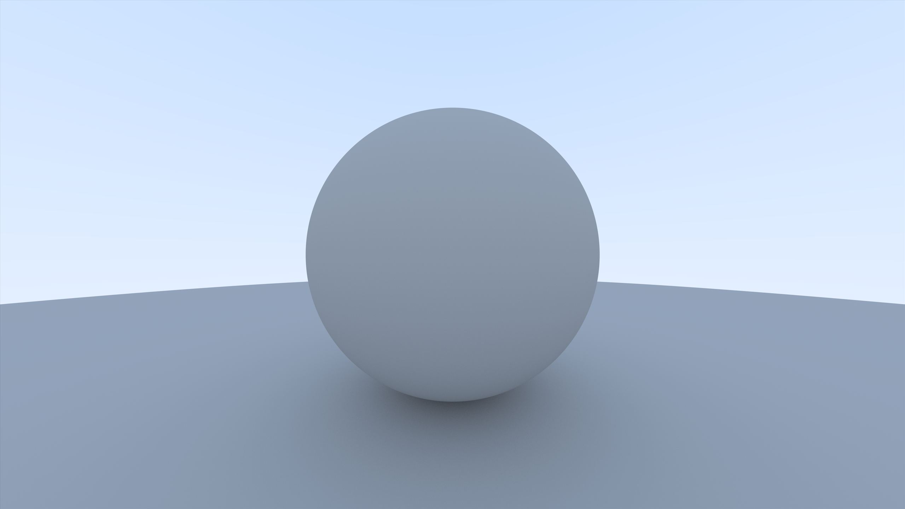
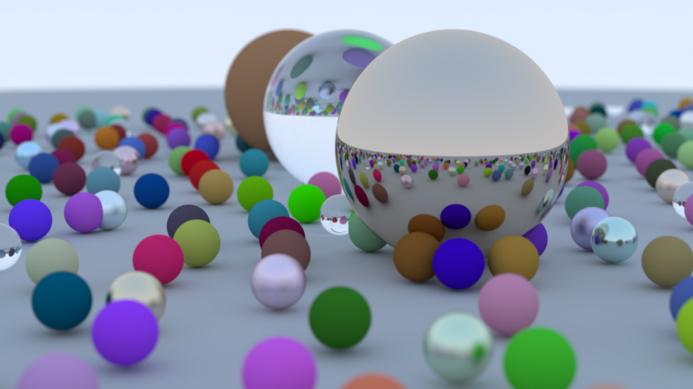

# DubuMan

## A CUDA accelerated raytracer

### Features

- Render primitives:
  - Sphere
- Improved performance using CUDA
- Denoising using OpenImageDenoise

### Setup

#### CUDA [required]

Just install [CUDA Toolkit](https://developer.nvidia.com/cuda-toolkit).

#### OpenImageDenoise (OIDN) [optional]

Add the binary path to your environment `PATH`:`{OIDN_SDK}/bin)`.

Create the environment variable `OIDN_CMAKE_DIR`:`{OIDN_SDK}/lib/cmake/OpenImageDenoise-<version>/)`.

Finally, pass CMake the option `-DUSE_OIDN=ON`.

### Todo

- Implement resource pools for hittables, materials, etc., see [Introducing Low-Level GPU Virtual Memory Management](https://developer.nvidia.com/blog/introducing-low-level-gpu-virtual-memory-management/).
- Use RT Cores, see [NVIDIA OptiX Ray Tracing Powered by RTX](https://developer.nvidia.com/blog/nvidia-optix-ray-tracing-powered-rtx/).

### Screenshots

Rendering normals on a sphere

Lambertian shading 

Denoised using OpenImageDenoise

The buffers used by OpenImageDenoise (Input, Output, Normal, Albedo)

The final render of the first book, using OIDN for denoising.

